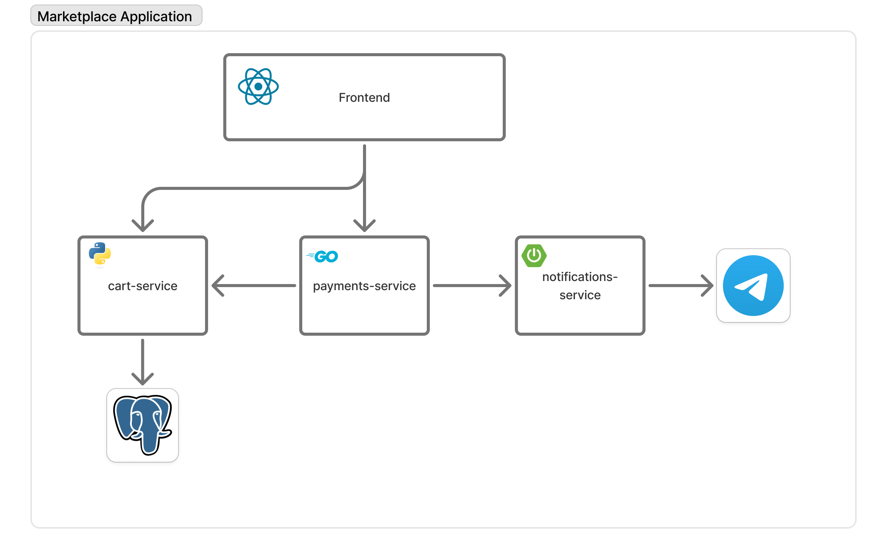

# 🛍 Polyglot Shop - Полиглотный интернет-магазин

Демонстрационный проект интернет-магазина, состоящий из трех микросервисов на разных языках программирования и технологиях, а также Frontend UI для него.

## 🏗 Архитектура



## 🚀 Быстрый старт

### Автоматическая установка

```bash
# Клонируйте проект (если еще не сделали)
git clone <repo-url>
cd market-polyglot

# Делаем скрипты исполняемыми
chmod +x scripts/*.sh

# Запускаем автоматическую установку
./scripts/setup.sh

# Запускаем все сервисы одновременно
./scripts/start-all.sh
```

### Ручной запуск

```bash
# 1. База данных
docker-compose up -d postgres

# 2. Backend (Django) - Терминал 1
cd backend
python3 -m venv venv
source venv/bin/activate
pip install -r requirements.txt
python manage.py migrate
python manage.py loaddata fixtures/initial_data.json
python manage.py runserver

# 3. Frontend (React) - Терминал 2
cd frontend
npm install
npm run dev

# 4. Payment Service (Go) - Терминал 3
cd payment-service
go mod tidy
go run main.go

# 5. Notification Service (Spring Boot) - Терминал 4
cd notification-service
chmod +x mvnw
./mvnw spring-boot:run
```

## 🔗 URLs сервисов

- **Frontend**: http://localhost:5173
- **Backend API**: http://localhost:8000
- **Payment Service**: http://localhost:8080  
- **Notification Service**: http://localhost:8081
- **Django Admin**: http://localhost:8000/admin

## 📋 Функциональность

### Frontend (React + TypeScript)
- ✅ Список товаров (`/products`)
- ✅ Детальная страница товара (`/products/:id`)
- ✅ Корзина (`/cart`)
- ✅ Добавление товаров в корзину
- ✅ Оформление заказа
- 🚧 TODO: Похожие товары (компонент-заглушка создан)

### Backend (Django + PostgreSQL)
- ✅ REST API для товаров
- ✅ Управление корзиной
- ✅ PostgreSQL база данных
- ✅ Raw SQL запрос для получения корзины
- ✅ Django Admin панель
- ✅ CORS настройки

### Payment Service (Go)
- ✅ Обработка заказов
- ✅ Получение данных корзины из Django
- ✅ Имитация оплаты (1 секунда)
- ✅ Генерация Payment ID
- ✅ Отправка в Notification Service

### Notification Service (Spring Boot)
- ✅ Получение данных заказа
- ✅ Форматирование сообщений
- ✅ Отправка в Telegram API
- ✅ Конфигурация через переменные окружения

## 🧪 Тестирование

```bash
# Тест всех API endpoints
./scripts/test-api.sh

# Или вручную
curl http://localhost:8000/products/
curl http://localhost:8000/cart/1/
curl -X POST http://localhost:8080/checkout \
  -H "Content-Type: application/json" \
  -d '{"user_id":1}'
```

## 📱 Настройка Telegram

1. Создайте бота через [@BotFather](https://t.me/botfather)
2. Получите токен бота
3. Найдите chat_id: отправьте сообщение боту, затем откройте:
   ```
   https://api.telegram.org/bot<TOKEN>/getUpdates
   ```
4. Настройте в `notification-service/src/main/resources/application.properties`:
   ```properties
   telegram.bot.token=YOUR_BOT_TOKEN
   telegram.bot.chat-id=YOUR_CHAT_ID
   ```

## 🔄 Демо-поток

1. Откройте http://localhost:5173
2. Просмотрите товары
3. Добавьте товары в корзину
4. Перейдите в корзину
5. Нажмите "Checkout"
6. Проверьте логи сервисов
7. Получите уведомление в Telegram (если настроено)

## 📊 Технологии

| Сервис | Язык/Framework | База данных | Порт |
|--------|---------------|-------------|------|
| Frontend | React + TypeScript + Vite | - | 5173 |
| Backend | Django + DRF | PostgreSQL | 8000 |
| Payment | Go + Gin | - | 8080 |
| Database | PostgreSQL | - | 5432 |

## 📂 Структура проекта

```
market-polyglot/
├── 📁 frontend/              # React + TypeScript
│   ├── src/
│   │   ├── pages/           # Страницы приложения
│   │   ├── components/      # React компоненты
│   │   └── api.ts          # API клиент
│   └── package.json
├── 📁 backend/              # Django + PostgreSQL  
│   ├── shop/               # Django приложение
│   ├── fixtures/           # Начальные данные
│   └── manage.py
├── 📁 payment-service/      # Go сервис
│   ├── main.go
│   └── go.mod
├── 📁 notification-service/ # Spring Boot
│   ├── src/main/java/
│   └── pom.xml
├── docker-compose.yml      # PostgreSQL
└── README.md
```

## ⚠️ Troubleshooting

**База данных:**
```bash
docker-compose up -d postgres
# Подождите 10 секунд перед запуском Django
```

**CORS ошибки:**
- Убедитесь, что все сервисы на правильных портах
- Проверьте Django settings.py

**Go модули:**
```bash
cd payment-service && go mod tidy
```

**Java/Maven:**
```bash
cd notification-service && ./mvnw clean install
```

## 📋 Требования ТЗ

✅ **Полиглотность**: React+TS, Django+Python, Go, Spring Boot+Java  
✅ **Связанность**: Все модули взаимодействуют по HTTP  
✅ **PostgreSQL**: Используется в Django  
✅ **Raw SQL**: Реализован в получении корзины  
✅ **TODO компонент**: SimilarProducts с заглушкой  
✅ **Telegram API**: Настроен в Spring Boot  
✅ **Минимализм**: Только необходимый функционал  

## 📝 Дополнительно

- Все сервисы имеют health check endpoints
- Настроены CORS для работы с фронтендом  
- Подготовлены скрипты для автоматизации
- Документация по настройке и запуску
- Примеры API запросов для тестирования
